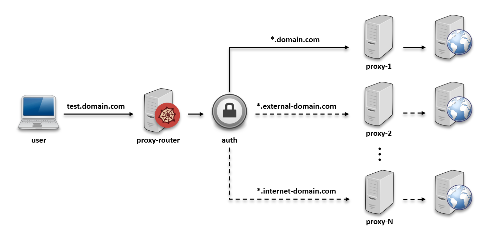

# </img> proxy-router

---

## 🚀 The developer-friendly proxy solution for complex environments
**Tired of juggling multiple proxies and constantly updating credentials across tools?**<br>

**proxy-router** is your one-stop solution to simplify proxy management, eliminate hardcoded secrets, and keep your 
workflows running smoothly.

* [Why proxy-router?](#-why-proxy-router)
* [How it works?](#-how-it-works)
* [Quick start](#-quick-start)
* [Key features](#-key-features)
* [Environment variables](#-environment-variables)
* [Updating credentials? Just edit one file](#-updating-credentials-just-edit-one-file)
* [Contribute & customize](#-contribute--customize)

---

## 🔥 Why proxy-router?
- ### The problem
  - **Broken workflows** when proxy passwords rotate (and you forget to update `git`, `npm`, `curl`, etc.)
  - **Hardcoded credentials** in config files (security risk + maintenance nightmare)
  - **Wasted time** manually configuring each tool to use the right proxy

- ### The solution
  - **Centralized credentials** – Update passwords in one place instead of every tool
  - **Automatic routing** – Smart hostname pattern matching (e.g., `*.my-company-domain.com`)
  - **Zero downtime** – Change credentials without restarting tools
  - **Docker-friendly** – Deploy in seconds, works seamlessly in dev environments

---

## 🛠️ How it works?
1. **Intercepts** requests from any tool (`git`, `npm`, `curl`, etc.)
2. **Match** the hostname against your routing rules
3. **Inject** the correct proxy credentials (no manual auth setup!) 
4. **Route** the request to the right proxy – automatically

</img>

---

## ⚡ Quick start
### 1. Configure once, forget forever
Define your proxies, credentials, and routing rules in simple JSON files:

- **[auth.json](./resources/auth.json)**
  ```json
  [
    {
        "id": "company-user",
        "username": "company-username",
        "password": "company-password"
      },
      {
        "id": "internet-user",
        "username": "internet-username",
        "password": "internet-password"
      }
  ]
  ```

- **[proxy.json](./resources/proxy.json)**
  ```json
  [
    {
      "id": "company-proxy",
      "hostname": "pxy-company.my-company-domain.com",
      "port": 3128,
      "authenticationId": "company-user"
    },
    {
      "id": "external-proxy",
      "hostname": "pxy-external.my-company-domain.com",
      "port": 3128,
      "authenticationId": "company-user"
    },
    {
      "id": "internet-proxy",
      "hostname": "pxy-internet.my-company-domain.com",
      "port": 3128,
      "authenticationId": "internet-user"
    }
  ]
  ```

- **[routing.json](./resources/routing.json)**
  ```json
  [
    {
      "requestHostnamePattern": "*.my-company-domain.com",
      "proxyId": "company-proxy"
    },
    {
      "requestHostnamePattern": "*.external-domain.com",
      "proxyId": "external-proxy"
    },
    {
      "requestHostnamePattern": "pxy-internet.my-company-domain.com",
      "proxyId": "internet-proxy"
    }
  ]
  ```

### 2. Run with Docker
- **Docker Compose**
  ```yaml
  services:
    proxy-router:
      container_name: proxy-router
      image: danozka/proxy-router
      ports:
        - "8888:8888"
      restart: unless-stopped
      volumes:
        - ./secrets/auth.json:/app/auth.json        # Update path with your auth config
        - ./secrets/routing.json:/app/routing.json  # Update path with your routing config
        - ./secrets/proxy.json:/app/proxy.json      # Update path with your proxy config
  ```

- **Docker CLI**
  ```bash
  docker run -d \
    --name proxy-router \
    -p 8888:8888 \
    --restart=unless-stopped \
    -v ./secrets/auth.json:/app/auth.json \        # Update path with your auth config
    -v ./secrets/routing.json:/app/routing.json \  # Update path with your routing config
    -v ./secrets/proxy.json:/app/proxy.json \      # Update path with your proxy config
    danozka/proxy-router
  ```

### 3. Point your tools to `http://localhost:8888`
- **git**:  
  ```bash
  git config --global http.proxy http://localhost:8888
  ```  
- **npm**:  
  ```bash
  npm config set proxy http://localhost:8888
  ```  
- **curl**:  
  ```bash
  export http_proxy=http://localhost:8888
  ```  

---

## 🎯 Key features
- **Wildcard host matching** – Route `*.internal.com` and `api.external.com` differently
- **Dynamic auth headers** – No more editing `.npmrc` or `.gitconfig` for password changes
- **Lightweight & fast** – Low-latency forwarding with configurable timeouts
- **Docker & CI-ready** – Prebuilt image + compose support

---

## 📦 Environment variables
|           **Variable**           |    **Default**    |                    **Description**                    |
|:--------------------------------:|:-----------------:|:-----------------------------------------------------:|
|         `LOGGING_LEVEL`          |       INFO        |              Logging level of the proxy               |
|     `AUTH_CONFIG_FILE_PATH`      |  /app/auth.json   |     Path to the authentication configuration file     |
|    `ROUTING_CONFIG_FILE_PATH`    | /app/routing.json |     Path to the routing rules configuration file      |
|     `PROXY_CONFIG_FILE_PATH`     |  /app/proxy.json  |        Path to the proxies configuration file         |
| `PROXY_SERVER_BUFFER_SIZE_BYTES` |       4096        | Buffer size in bytes of each streaming request reader |
|       `PROXY_SERVER_HOST`        |      0.0.0.0      |       Hostname that the proxy will be bound to        |
|       `PROXY_SERVER_PORT`        |       8888        |          Port that the proxy will listen to           |
|  `PROXY_SERVER_TIMEOUT_SECONDS`  |        2.0        |    Time in seconds to shutdown unused connections     |

---

## 🔄 Updating credentials? Just edit one file
**No restarts. No tool reconfigurations.**

Change [auth.json](./resources/auth.json), and **proxy-router** handles the rest.

---

## 🤝 Contribute & customize
PRs welcome! Licensed under [MIT](./LICENSE).
